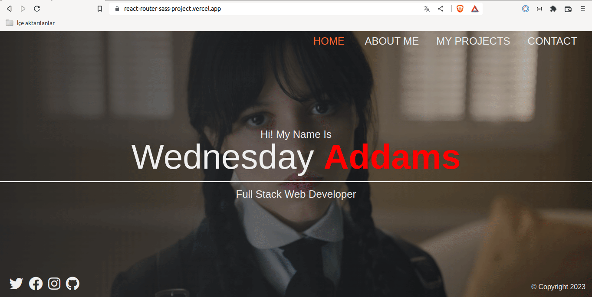

<p>Clarusway</p>

# Sass Portfolio with React Router

## Description

Project aims to create a Sass Portfolio with Router.

## Problem Statement

- We are adding a new project to our portfolios. So you and your colleagues have started to work on the project.

## Project Skeleton

```
009 - Sass Portfolio with React Router (folder)
|
|----readme.md         # Given to the students (Definition of the project)
SOLUTION
├── public
│     └── index.html
├── src
│   ├── App.js
│   ├── App.scss
│   ├── assets
│   │   └── img
│   ├── components
│   │   ├── Error
│   │   │   ├── NotFound.css
│   │   │   └── NotFound.jsx
│   │   ├── Footer
│   │   │   ├── Footer.jsx
│   │   │   └── Footer.scss
│   │   ├── Navbar
│   │   │   ├── Navbar.jsx
│   │   │   └── Navbar.scss
│   │   └── ProjectCards.jsx
│   ├── helper
│   │   └── imageData.js
│   ├── index.css
│   ├── index.js
│   ├── pages
│   │   ├── about
│   │   │   ├── About.jsx
│   │   │   └── About.scss
│   │   ├── contact
│   │   │   ├── Contact.jsx
│   │   │   └── Contact.scss
│   │   ├── home
│   │   │   ├── Home.jsx
│   │   │   └── Home.scss
│   │   └── projects
│   │       ├── Projects.jsx
│   │       └── Projects.scss
│   ├── router
│   │   └── router.js
│   └── scss
│       ├── _mixins.scss
│       ├── _reset.scss
│       └── _variables.scss
├── package.json
└── yarn.lock
```

## Expected Outcome



## Objective

Build a Sass Portfolio with using ReactJS, react-router and sass.

### At the end of the project, following topics are to be covered;

- HTML

- CSS

- JS

- ReactJS

### At the end of the project, students will be able to;

- Improve coding skills within HTML & CSS & JS & ReactJS.

- Use git commands (push, pull, commit, add etc.) and Github as Version Control System.

## Steps to Solution

- Step 1: Create React App using `npx create-react-app sass-portfolio-router`.

- Step 2: Build Sass Portfolio with using ReactJS, react-router and sass..

- Step 3: Push your application into your own public repo on Github.

- Step 4: Add project gif to your project and README.md file.

## Notes

- You can add additional functionalities and design to your app.

## Demo

<a href="https://react-router-sass-project.vercel.app/">Sass Portfolio with React Router</a>

**<p align="center">&#9786; Happy Coding &#9997;</p>**
