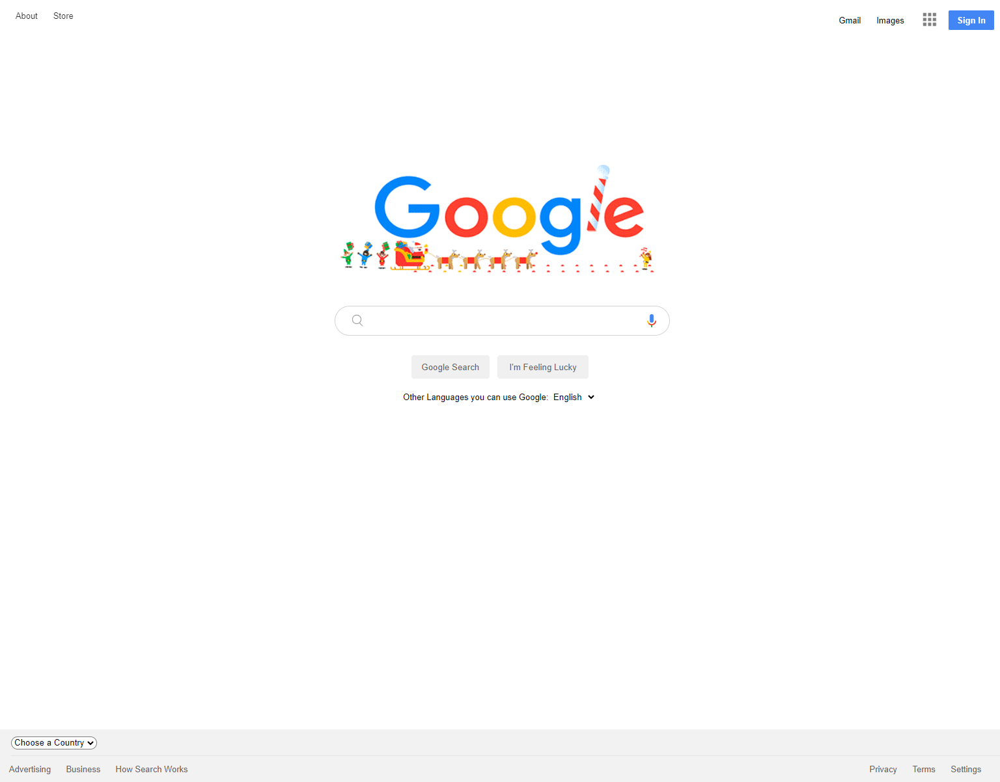

<p>Clarusway</p>

# Project-03 : Google Landing Page (HC-03)

## Description
&nbsp;&nbsp;&nbsp;&nbsp;&nbsp;&nbsp;This project aims to recreate the iconic Google landing page as a learning exercise for web development. 

## Problem Statement

- Your organization has recently begun work on a project to build a Google landing page. So you and your coworkers have begun working on the project.

## Project Skeleton 

```
003-google-landing-page (folder)
|
|----readme.md         # Given to the students (Definition of the project)          
|----images            # Given to the students (Definition of the project)   
        |----appicon.png   
        |----gfavicon.png
	|----google_microphone.png
	|----googlelogo.png
	|----icon-menu.jpg
	|----magnifying_glass.png
|----solution
        |----index.html  #This file contains the HTML structure for the landing page.
        |----style.css   
        |----images
```

## Expected Outcome



## Objective

Build a Landing that is functionally similar to this: [Google Landing Page](https://cw-barry.github.io/google-landing--page/)

### At the end of the project, following topics are to be covered;

- HTML 

- List Properties-Tables / CSS-The Display Property-The position Property

- Overflow Property-The float Property-Opacity / Transparency-Units in CSS

- CSS Setting height and width-CSS Outline-CSS Combinators

- By working on this project, you can enhance your HTML and CSS skills, practice responsive design, and gain hands-on experience in building a user interface.


### At the end of the project, students will be able to;

- improve coding skills within HTML & CSS

- use git commands (push, pull, commit, add etc.) and Github as Version Control System.

## Steps to Solution

- Step 1: Download or clone project repo on Github 

- Step 2: Create project folder for local public repo on your pc

- Step 3: Create Google Landing Page

>>Part-1 HTML Structure

	- Creat structure of the HTML5
	- Give name of your project (title)
	- Create the main structure of the header (nav class="header-left)
	- Create the main structure of the header (nav class="header-right)
	- Create serachbar (div class="searchbar")
	- Create footer 

>>Part-2 CSS Structure

	- Set a background and define font-color="white"
	- Set container background color and margin
	- Define others color-size-padding etc...

- Step 4: Push your application into your own public repo on Github

- Step 5: Deploy your application on Github template to showcase your app within your team.

## Notes

- You can use HTML,and CSS to complete this project.

- This project is inspired by the Google landing page.

## Resources

-  [Images](./images)


<p align="center"> &#8987; <strong>Happy Coding</strong>  &#9997; </p>

