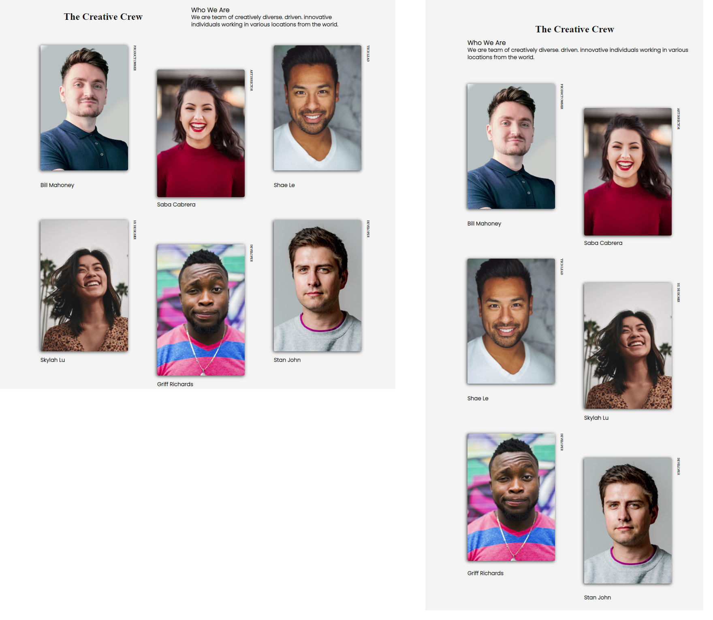

<p>Clarusway</p>

# Project-04 : Team Members Page (HC-04)

## Description
- The project aims to create a web page showcasing your development team for your company's website.

## Problem Statement

- Your company is in the process of updating its website and has tasked you with creating the development team page.

## Project Skeleton 

```
004-team-members-page(folder)
|
|----readme.md         # Given to the students (Definition of the project)
|----/images # Contains development team members photos         
|----solution
        |----index.html  
        |----style.css   
        
```

## Expected Outcome



## Objective

Build a responsive web page similar to the [Project Snapshot](./teammembers.png) 

### At the end of the project, following topics are to be covered;

- HTML 

- CSS


### At the end of the project, students will be able to;

- Improve coding skills within HTML & CSS

- Use git commands (push, pull, commit, add etc.) and Github as Version Control System.

## Steps to Solution
  
- Step 1: Download or clone project repo on Github 

- Step 2: Create a project folder for the local public repo on your PC

- Step 3: Team Members Web Page

>Part-1 HTML Structure

	- Creat the structure of HTML5
	- Give the name of your project (title)
	- Create the main structure of HTML

>>Part-2 CSS Structure

    - Apply all the technologies you've learned (Flexbox, Grid).
	- Set a background and define font color
	- Set container background color and margin
	- Define others color-size-padding, etc.

### Images
[Images Folder](./images/)


## Notes

- Pay attention to the direction of the texts in the picture.

- **Your page should be responsive web.**

<p align='center'> <strong>⌛ Happy Coding  ✍ </strong></p>

